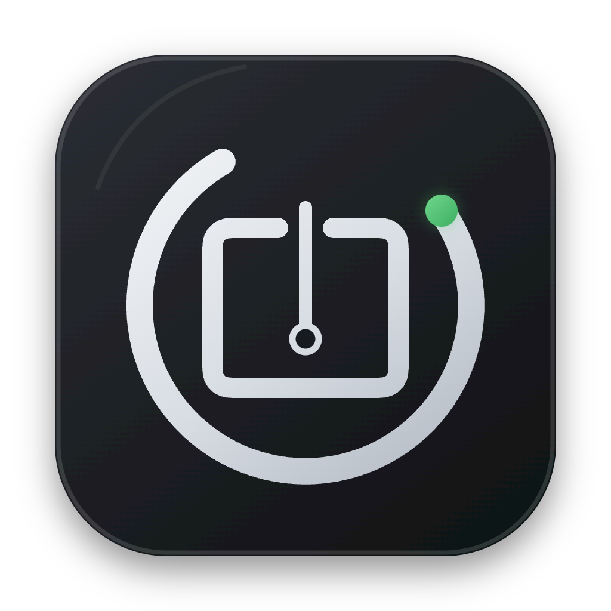
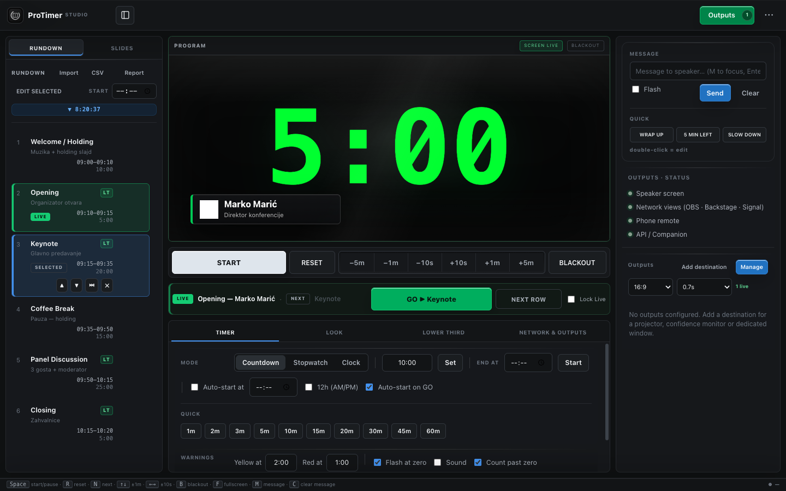
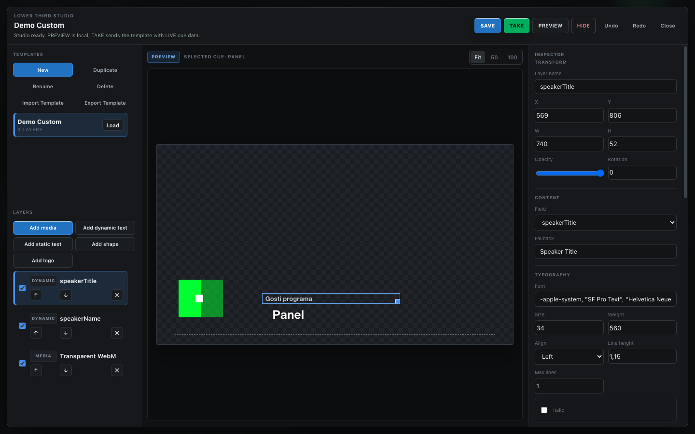
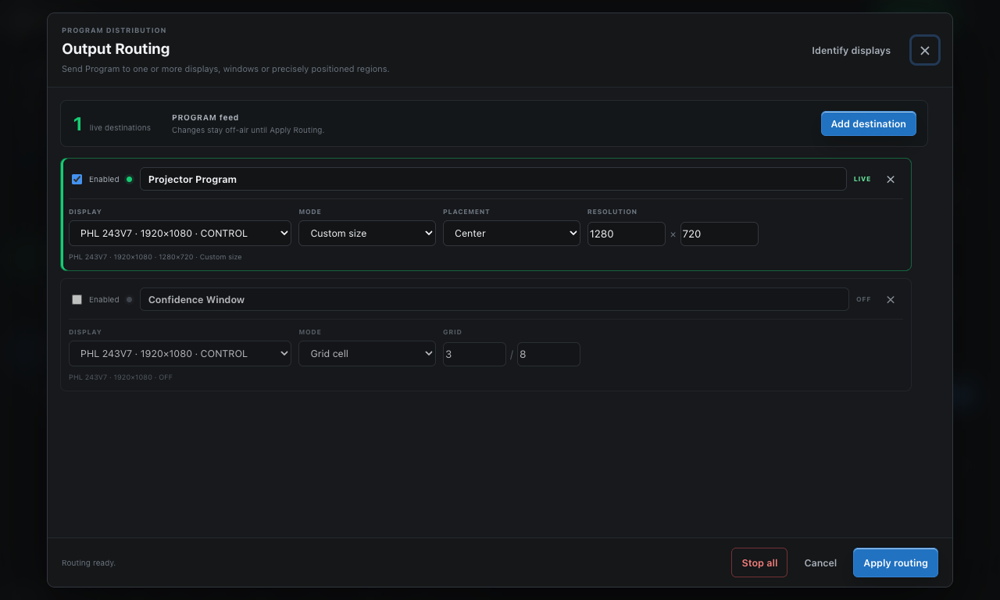

<p align="center">
  
</p>

<h1 align="center">ProTimer Studio</h1>

<p align="center">
  Free, open-source event control for rundowns, speaker timing, lower thirds, screen content and multiple displays.
</p>

<p align="center">
  <a href="https://github.com/srdjankotarlic/protimer-studio/actions/workflows/ci.yml"></a>
  <a href="https://github.com/srdjankotarlic/protimer-studio/releases"></a>
  <a href="LICENSE"></a>
  
  
</p>



> **Public beta:** the core Mac workflow has extensive local test coverage. Windows packages are built automatically but still need broader real-hardware feedback. Current downloads are not yet Developer ID/AuthentiCode signed, so the operating system may show a security warning. Read [Install the beta](#install-the-beta) before downloading.

## Why ProTimer Studio

Live event teams often combine a timer, rundown spreadsheet, speaker messages, lower-third tool and several output windows. ProTimer Studio brings those jobs into one local, offline-first operator workspace without an account or subscription.

- Rundown-first **NEXT / LIVE / GO** workflow.
- Countdown, stopwatch and clock with warnings, overtime and scheduled start.
- Multiple Program outputs: fullscreen, window, exact pixel size or grid cell.
- Phone remote, backstage view and podium Signal Light on the local network.
- Lower Third Studio with dynamic cue fields, text, shapes, logos, images and video.
- Screen content for images, video, PDF, text, logos, timer and blank states.
- Autosave, crash recovery and portable `.protimer-show` / `.protimer-lt` packages.
- HTTP and OSC control plus post-show timing reports and CSV export.
- English and Serbian full UI, plus 35 core language packs with English fallback.

## Install the beta

Open [ProTimer Studio 0.9.0 Beta 1](https://github.com/srdjankotarlic/protimer-studio/releases/tag/v0.9.0-beta.1) and download the file for your computer.

### macOS Apple Silicon

1. Download `ProTimer-Studio-*-arm64.dmg`.
2. Open the DMG and drag **ProTimer Studio** to Applications.
3. Because the beta is not yet notarized, macOS may block the first launch. Open **System Settings → Privacy & Security**, confirm that you downloaded the app from this repository, and choose **Open Anyway**.

Intel Mac builds are not currently published.

### Windows 10/11 x64

1. Download `ProTimer-Studio-Setup-*.exe` for the installer, or `ProTimer-Studio-*-portable.exe` for the no-install version.
2. Windows SmartScreen may show **Unknown publisher** because the beta is not yet Authenticode signed. Continue only if the file came from this repository and its SHA-256 matches `SHA256SUMS.txt` in the release.
3. Allow private-network access if you plan to use phone, backstage, Signal Light or browser outputs.

See [system requirements](docs/SYSTEM-REQUIREMENTS.md) and [known limitations](docs/KNOWN-LIMITATIONS.md).

## Quick start

1. Open **New Show** and enter the event details.
2. Paste rows from Excel/Google Sheets or import CSV/TSV.
3. Assign the speaker display and finish **Preflight**.
4. Select a cue to prepare NEXT; only **GO NEXT** changes LIVE.
5. Start the timer and confirm Program before enabling venue outputs.

The complete workflow is in the [User Guide](docs/USER-GUIDE.md).

## Product views

| Lower Third Studio | Output Routing |
|---|---|
|  |  |

## Local network safety

The app serves output, remote, backstage and Signal Light pages on the production LAN. Control/API links include a per-launch token, while several read-only views are intentionally accessible on the local network. Use a trusted show network and do not expose ports directly to the public internet. See [Security](SECURITY.md).

## Documentation

- [User Guide](docs/USER-GUIDE.md)
- [System Requirements](docs/SYSTEM-REQUIREMENTS.md)
- [Known Limitations](docs/KNOWN-LIMITATIONS.md)
- [Languages](docs/LOCALIZATION.md)
- [Companion / HTTP / OSC](docs/COMPANION.md)
- [Testing](docs/TESTING.md)
- [Public beta verification](docs/PUBLIC-BETA-VERIFICATION.md)
- [Architecture](ARCHITECTURE.md)
- [Privacy](docs/PRIVACY.md)

## Build from source

Requires Node.js 22.12 or later.

```bash
git clone https://github.com/srdjankotarlic/protimer-studio.git
cd protimer-studio
npm ci
npm start
```

Headless tests:

```bash
npm test
npm audit
```

Local package builds:

```bash
npm run dist:mac
npm run dist:win
```

## Feedback

This beta exists to learn from real operators. Please open a [bug report](https://github.com/srdjankotarlic/protimer-studio/issues/new?template=bug_report.yml) with the app version, operating system, display setup and reproducible steps. Feature ideas belong in [Discussions](https://github.com/srdjankotarlic/protimer-studio/discussions).

Contributions are welcome; read [CONTRIBUTING.md](CONTRIBUTING.md) first. Security issues should use GitHub's private vulnerability reporting instead of a public issue.

## Srpski

ProTimer Studio je besplatna open-source aplikacija za stage timer, rundown, poruke govorniku, potpise, sadržaj za ekrane i više izlaza. Engleski je podrazumevani jezik, a kompletan srpski interfejs bira se u vrhu aplikacije. Za početak pogledajte [kratko uputstvo na srpskom](docs/USER-GUIDE.md#brzi-početak-na-srpskom).

## License

[MIT](LICENSE) — free to use, modify and distribute. Please keep the copyright and license notice with substantial copies.
