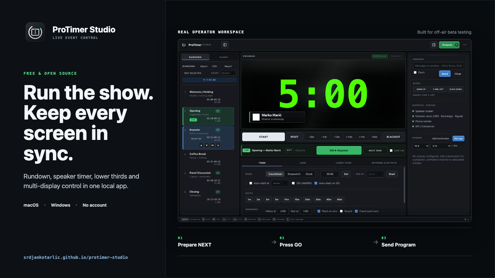

# Public beta adoption plan

The immediate objective is not a large download number. It is to find a small group of real operators, observe whether the product solves a show-site problem and collect reproducible evidence before stable release.

## First validation cohort

Recruit 10 people across these roles:

- AV freelancers running conferences or corporate events;
- church production volunteers or technical directors;
- conference/venue operators using confidence monitors;
- OBS/vMix operators who can evaluate the browser output off-air;
- one Windows operator with two physical displays.

At least three should complete a full dry run. At least one independent operator must complete the documented external-beta release gate with no unresolved blocker.

## What to ask them to do

1. Install the published package on a non-critical machine.
2. Create or import a five-cue rundown.
3. Exercise NEXT/LIVE/GO, timer, message and BLACKOUT.
4. Add one lower third and one image/video/PDF screen item.
5. Configure every available output and reconnect one display.
6. Open phone remote, backstage and Signal Light on the local network.
7. Export and reopen a `.protimer-show` package.
8. Report the first confusing step, any failure and the workflow they would actually use.

Ask for the app version, OS, CPU, display arrangement and exact reproduction steps. Never ask testers to post client names, IP addresses, tokens or confidential media.

## Natural outreach copy

### Suggested Reddit post

**Title:** I built a free open-source stage timer and rundown app - looking for off-air testers

I built ProTimer Studio for live-event teams that need a rundown, speaker timer, messages, lower thirds and multiple screen outputs in one local app.

Create or import a rundown, prepare the next cue, press GO to make it live, then send the timer or screen content to one or more displays.

It is free, open source, and available for Apple Silicon Mac and Windows:
https://srdjankotarlic.github.io/protimer-studio/

I am looking for operators willing to test it off-air and tell me what is confusing or breaks on their setup.

Disclosure: I am the creator and development was AI-assisted. The packaged Mac build was tested on a real two-display setup; Windows still needs physical beta feedback.

Use the real product image below with the post:

Do not describe the app as OBS/vMix certified, signed, notarized or production-proven.

## Feedback and metrics

- Bugs: GitHub bug-report form.
- Setup questions and workflow feedback: [public beta Discussion](https://github.com/srdjankotarlic/protimer-studio/discussions/1).
- Private security issues: GitHub private vulnerability reporting.
- Weekly signals: repository visitors/clones, release-asset counters, completed test reports and unresolved blockers.

GitHub asset counts are aggregate downloads, not verified people or successful installations. The primary success metric is a completed operator workflow with enough evidence to reproduce and fix problems.

## Weekly loop

1. Invite a small, relevant group rather than posting identical copy everywhere.
2. Reproduce every credible issue before changing the product.
3. Fix release blockers first; record nice-to-have ideas separately.
4. Publish a new beta only after designated-display and native package gates pass.
5. Summarize what changed and ask previous testers to retry the exact failed workflow.
